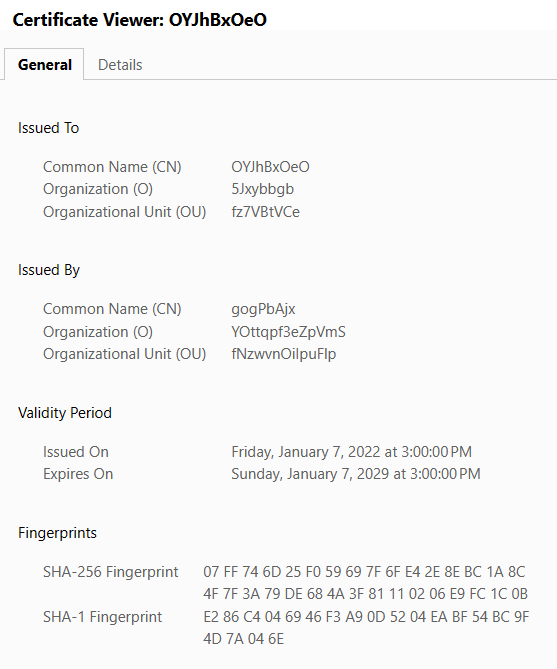

# ⚒️ fake-cert

This repository is a Go library that generates random TLS certificates 🎊

## 🏅 Feature

Generate a random tls certificate with:

- [x] random serial number
- [x] random subject information
- [x] random validity, the year, the month and the day are random
- [ ] random encryption suite (defence [ja3](https://engineering.salesforce.com/tls-fingerprinting-with-ja3-and-ja3s-247362855967/))
- [ ] copy certificate information from certain website (defence [ja3](https://engineering.salesforce.com/tls-fingerprinting-with-ja3-and-ja3s-247362855967/))

**Preview:**  

 

## 🎨 Usage

Create a simple https server:

```ruby
go get -u github.com/wux1an/fake-useragent
```

```go
package main

import (
	"crypto/tls"
	"github.com/wux1an/fake-cert"
	"fmt"
	"net/http"
)

func main() {
	http.HandleFunc("/", func(writer http.ResponseWriter, request *http.Request) {
		writer.Write([]byte("Your IP Address: " + request.RemoteAddr))
	})

	// 1. create tls certification
	certs := cert.Random(2048)
	listener, _ := tls.Listen("tcp", "127.0.0.1:2023", &tls.Config{Certificates: []tls.Certificate{certs}})

	// 2. start a http server
	fmt.Println("http served at https://127.0.0.1:2023")
	_ = http.Serve(listener, nil)
}
```

## 🔗 References

- https://github.com/kost/revsocks